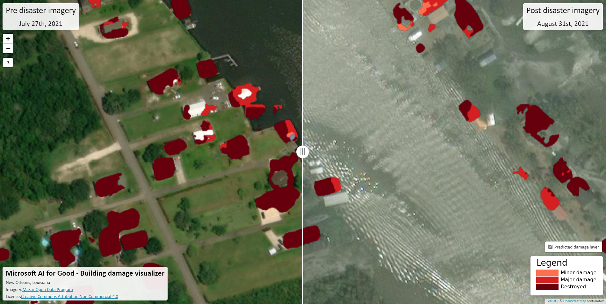

# Damage Assessment Visualizer

The Damage Assessment Visualizer leverages satellite imagery from a disaster region to visualize conditions of building and structures before and after a disaster. It includes a visual layer on top of the satellite images which predicts the extent of damage of individual structures. This information provides critical information for frontline workers on the ground to assist with logistics operations after a disaster hits.

Please see the following link for the [Damage Assessment Visualizer Repository](https://github.com/microsoft/Damage_Assessment_Visualizer)

