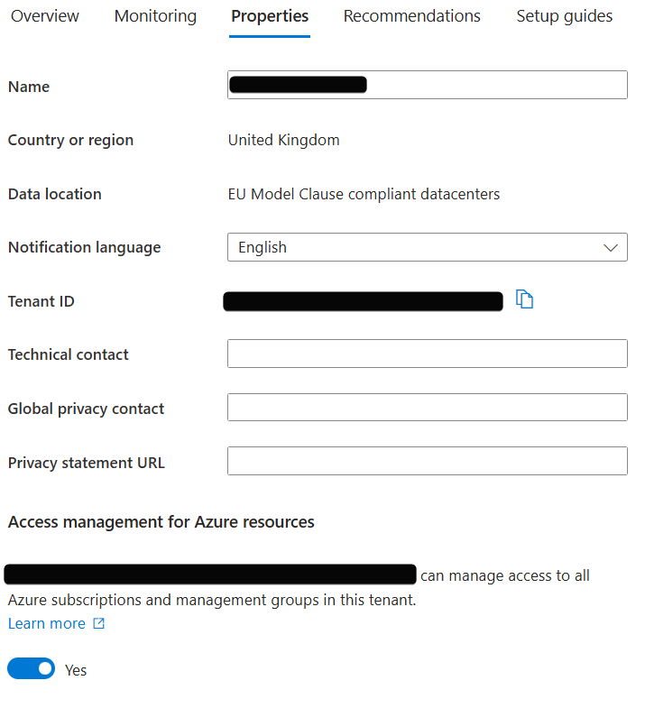

# 🚀 Azure Landing Zone for Nonprofits Deployment Guide

This guide provides a step-by-step approach to deploying the **Azure Landing Zone for Nonprofits**, ensuring a scalable and secure cloud infrastructure aligned with best practices.

---

## 📌 Prerequisites

Before initiating the deployment, ensure you have the following:

- **Dedicated Azure subscriptions**: Two dedicated subscriptions are required to separate platform components for better management and security.
- **A global admin in Microsoft Entra ID**: You must have the **Global Administrator** role in **Microsoft Entra ID** (formerly Azure Active Directory).
- **Elevated Access**: Ensure you have **Owner** permissions at the **Elevation of privileges:**
  - Elevate the global admin privileges to grant the **User Access Administrator** role at the tenant root scope (/).
  - Perform an explicit role assignment (Azure RBAC) at the tenant root scope using Azure CLI or PowerShell.

## 🛠 Elevate access for deployment

To manage resources across the tenant, temporarily elevate your access as a global admin. After deployment, remove the elevated access.

Sign into the Azure portal as the global admin.

Navigate to **Microsoft Entra ID > Properties**.

Under Access management for Azure resources, set the toggle to Yes.



## 🛠 Grant explicit access at tenant root scope
Use either Azure CLI or PowerShell to assign the necessary permissions to the user performing the deployment.

You don't have to be a global admin to deploy Azure Landing Zones. This role assignment can be made to a different user or group.


Using **Bash (Azure CLI)**:
```sh

# Sign into AZ CLI, this will redirect you to a web browser for authentication if required 
az login 
 
# Assign Owner role to Tenant root scope ("/") as Owner (fetches object Id of the current user) 
az role assignment create --scope '/' --role 'Owner' --assignee-object-id $(az ad signed-in-user show --query "objectId" --output tsv)

```

Using **PowerShell**:

```sh

# Sign in to Azure from PowerShell, this redirects you to a web browser for authentication if required
Connect-AzAccount 
 
# Get object Id of the current user for the role assignment 
$user = Get-AzADUser -UserPrincipalName (Get-AzContext).Account 
 
# Assign Owner role to Tenant root scope ("/") as a User Access Administrator 
New-AzRoleAssignment -Scope '/' -RoleDefinitionName 'Owner' -ObjectId $user.Id

   ```

It can take up to 15 minutes for permissions to propagate at the tenant root scope. Sign out and sign back in to refresh the token before proceeding with the deployment.

---

## ✅ **Deploy the Azure Landing Zone Template**
With the necessary permissions in place, proceed to deploy the landing zone.

### ⚙️ **Prepare inputs**

Gather all required input values before starting the deployment. These values are used throughout the process and are listed in the following table.

You must provide details including:

- Azure subscription and deployment region
- Network configuration (for example, Virtual Network name and subnet details)
- Security settings (for example, Key Vault name, Recovery Services Vault name)
- Management group structure
- Some values, such as Key Vault names, must be globally unique and might need modification.

### Azure Landing Zone configuration parameters

This table outlines the key parameters required for deploying the **Azure Landing Zone**.

| **Section** | **Field** | **Description** | **Example value** |
|------------|----------|----------------|-------------------|
| **Deployment location** | Directory | Tenant value | `{your_org}.onmicrosoft.com` |
| **Deployment location** | Region | Select the Azure region that's right for you and your customers. Keep in mind that not every resource is available in every region. | East US |
| **Management Group and Subscription Organization** | Management Group prefix | Management Group prefix to create the management group hierarchy under the tenant root group. | Nonprofit |
| **Management and Connectivity** | Subscription | Azure subscription to deploy resources. | Nonprofit-SubscriptionName1-PROD |
| **Management and Connectivity** | Azure Monitor | Deploy Log Analytics workspace and enable monitoring for your platform and resources. | Yes |
| **Management and Connectivity** | Log Analytics Data Retention (days) | Number of days for data retention. | 30 |
| **Management and Connectivity** | Virtual Network Name | Name of the Virtual Network for networking resources. | `ntwrk01` |
| **Management and Connectivity** | Virtual Network Address Prefix | The CIDR block defining the address space for the Virtual Network. | 10.0.0.0/16 |
| **Management and Connectivity** | Subnet Name | Name of the subnet inside the Virtual Network. | subnet01 |
| **Management and Connectivity** | Subnet Address Prefix | The CIDR block for the subnet. | 10.0.1.0/24 |
| **Management and Connectivity** | VPN Gateway Subnet | Subnet reserved for the VPN Gateway. | 10.0.2.0/27 |
| **Management and Connectivity** | Enable DDoS Protection | Option to enable Distributed Denial-of-Service (DDoS) protection. | Yes |
| **Management and Connectivity** | Enable Microsoft Defender for Cloud | Option to enable Microsoft Defender for enhanced security. | Yes |
| **Management and Connectivity** | Recovery Services Vault Name | Name of the Azure Recovery Services Vault for backups. | recoveryKeyVault01 |
| **Management and Connectivity** | Key Vault Name | Name of the Azure Key Vault for storing secrets. This value must be globally unique, so consider adding the organization name or a suffix value. | keyVault01 |
| **Landing Zone** | Subscription | Subscription to deploy the landing zone resources. This subscription must be different from the one provided previously under **Management and Connectivity**. | Nonprofit-SubscriptionName2-PROD |
| **Landing Zone** | Virtual Network Name | Name of the Virtual Network for the landing zone. | spokeVNet01 |
| **Landing Zone** | Virtual Network Address Prefix | Address space assigned to the landing zone Virtual Network. | 10.1.0.0/16 |
| **Landing Zone** | Subnet Name | Name of the subnet for landing zone workloads. | subnet01 |
| **Landing Zone** | Subnet Address Prefix | Address range for the landing zone subnet. | 10.1.1.0/24 |
| **Landing Zone** | Key Vault Name | Key Vault for storing secrets in the landing zone. This value must be globally unique, so consider adding the organization name or a suffix value. | keyVault02 |
| **Landing Zone** | Recovery Services Vault Name | Vault for backups in the landing zone. | recoveryKeyVault02 |


---

### 📌 **Usage**
This table helps guide the configuration of the **Azure Landing Zone** by providing required values for **networking, security, subscriptions, and monitoring**. Ensure these parameters align with your organization's requirements before deployment.


### 🚀 **Deploy Azure Landing Zone**

1. Click the following link to open the deployment template in the Azure Portal:
[Azure Landing Zone for Nonprofits](https://aka.ms/ALZforSmallNonprofits)

2. On the **Deployment location** tab, select the Azure region where you want to deploy the resources. Choose the region that aligns with compliance requirements and the geographic location of your users. Select Next.

3. On the **Management Group and Subscription Organization** tab, organize subscriptions and management groups for the platform. In the **Management Group prefix** field, provide a unique prefix for the management group structure (maximum 10 characters). For example, **NPO**. Select **Next**.

4. On the **Management and Connectivity tab**, configure core platform services such as identity, management, and connectivity.

    a. Under Management subscription in the **Subscription** dropdown, select a subscription for core management resources.

    b. Under **Azure Monitor**, select **Yes** for **Deploy Log Analytics workspace** and **enable monitoring for your platform and resources**. Select the number of days you want for **Log Analytics Data Retention (days)**.

    c. Configure the hub and spoke networking topology.

        Example hub network configuration:

        - **Virtual Network Name**: ntwrk01  
        - **Virtual Network Address Prefix**: 10.0.0.0/16  
        - **Subnet Name**: subnet01  
        - **Subnet Address Prefix**: 10.0.1.0/24  
        - **VPN Gateway Subnet**: 10.0.2.0/27  
        - **Recovery Services Vault Name**: recoveryKeyVault01  
        - **Key Vault Name**: keyVault01  

    d. Select **Next**.


5. On the **Management and Connectivity** tab, configure spoke networks, backup and recovery, and workload landing zones.

    a. Under **Landing Zone subscription** in the **Subscription** dropdown, select a subscription. Make sure this subscription is different from the one selected in step 4.

    b. Complete the spoke network settings.

    - **Spoke network**: Provide the network name and address prefix for workload-specific spoke VNets.
    - **Backup and recovery**: Configure a Recovery Services vault for backup and disaster recovery.
    - **Key Vault**: Set up Azure Key Vault for secrets management.
    
    Example spoke network configuration:

    - **Virtual network name**: spokeVNet01
    - **Virtual network address prefix**: 10.1.0.0/16
    - **Subnet name**: subnet01
    - **Subnet address prefix**: 10.1.1.0/24
    - **Key Vault Name**: keyVault02
    - **Recovery Services vault name**: recoveryKeyVault02


6. Select **Review + Create**, and then select **Create**.


## 🔄 **Monitor Deployment Progress**
After submitting the deployment:
- **Check Notifications**: Monitor the deployment status through the **Notifications** pane in the Azure Portal.
- **Access Resource Group**: Navigate to the **resource group** specified during deployment to view the deployed resources.

---

## 🔧 **Post-Deployment Configuration**
After a successful deployment:

- **Review Management Groups**:  
  Ensure that the management group hierarchy aligns with your organization's governance model.
- **Assign Subscriptions**:  
  Move existing or new subscriptions into the appropriate **management groups**.
- **Configure Policies**:  
  Review and, if necessary, adjust **Azure Policies and Initiatives** applied to ensure compliance.

---

## 🛡 **Security and Compliance**
Deploying the **Azure Landing Zone for Nonprofits** includes implementing security features such as:

- **Microsoft Defender for Cloud**: Provides advanced threat protection and security posture management.
- **Azure Policy**: Ensures resources comply with organizational standards and service-level agreements.
- **Azure Blueprints**: Enables the deployment of a repeatable set of Azure resources that implement and adhere to organizational standards.

---

## 📜 **Additional Resources**
- [Azure Landing Zone for Nonprofits Documentation](https://learn.microsoft.com/en-us/industry/nonprofit/azure-landing-zone)
- [Microsoft Cloud Adoption Framework](https://learn.microsoft.com/en-us/azure/cloud-adoption-framework/)
- [Elevate Access in Azure](https://learn.microsoft.com/en-us/azure/role-based-access-control/elevate-access-global-admin)

---

### 🎯 **You're Ready to Deploy!**
If you have any questions, feel free to create an issue in the repository or reach out to your **Azure administrator**. 🚀
