Advanced Search with Bing News Solution Template Documentation
===========================================================

# Table of Contents
1. [Introduction](#introduction)
2. [Architecture](#architecture)
3. [System Requirements](#system-requirements)
4. [How to Install](#how-to-install)
5. [Architecture Deep Dive](#architecture-deep-dive)
6. [Model Schema](#model-schema)
7. [Reports Walkthrough](#report-walkthrough)
8. [Updating your Search Terms](#updating-your-search-terms)
9. [Estimated Costs](#estimated-costs)

### Introduction

The Bing News template spins up a sophisticated search solution, finding you the most relevant articles using machine learning techniques. The template stands up an end-to-end solution that finds articles via the Bing News API, enriches the data using machine learning and stores these enrichments in Azure SQL. Users can then use pre-built Power BI reports that leverage Microsoft research technology to start exploring the data and finding articles most relevant to them.
The template is aimed at anyone who is interesting in finding articles relevant to their chosen search query. It supports multiple personas ranging from a product manager keeping a pulse on the market to a ministry official interested in tracking the media’s reactions to recent policy announcements.
The following document provides a walkthrough of the architecture, a deep dive into every component, comments on customizability as well as information on additional topics like estimated costs. For any questions not covered in this document, please contact the team at <PBISolnTemplates@microsoft.com>

### Architecture

The flow of the Bing News solution template is as follows:

-   Logic Apps finds articles via the Bing News API

-   Logic App 

-   Azure Function enriches tweet and writes it to Azure SQL

-   Azure Function also calls textual analytics cognitive service to work out sentiment of tweet

-   Power BI imports data into it from Azure SQL and renders pre-defined reports

### System Requirements

Setting up the template requires the following:

-   Access to an Azure subscription

-   Power BI Desktop (latest version)

-   Power BI Pro (to share the template with others)

-   Twitter Account

### How to Install

Before diving into the components of the solution, we will go through how to set things up. To get started with the solution, navigate to the [Bing News template page]( https://powerbi.microsoft.com/en-us/solution-templates/bing-news/) and click **Install Now**.

**Getting Started:** Starting page introducing the template and explaining the architecture.

**Azure:** Use OAuth to sign into your Azure account. You will notice you have a choice between signing into an organizational account and a Microsoft (work/school account).

If you select a Microsoft account, you will need to provide the application with a domain directory. You can find your domain by logging into your Azure account and choosing from those listed when you click your e-mail in the top right hand corner:

If you belong to a single domain, simply hover over your e-mail address in the same place:

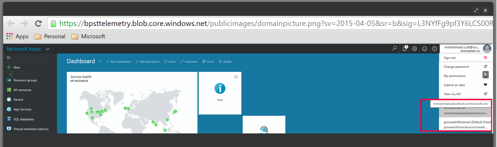

In this case, the domain is: richtkhotmail.362.onmicrosoft.com.

Logging into Azure gives the application access to your Azure subscription and permits spinning up Azure services on your behalf. It also lists the estimated costs of the template. If you want a more granular breakdown of the costs, please scroll down to the Estimated Costs section.
As a user navigates away from this page a new resource group gets spun up on their Azure subscription (the name is random but always prefixed by ‘SolutionTemplate-‘). This name can be changed under the advanced settings tab. All newly created resources go into this container.
**Cognitive Services:** Cognitive services are an Azure service that provide unique machine learning capabilities. This solution template uses the Text Analytics API to enrich data through sentiment analysis and key phrase extractions. It also uses the Bing News Search API to find articles based on the user’s search query.
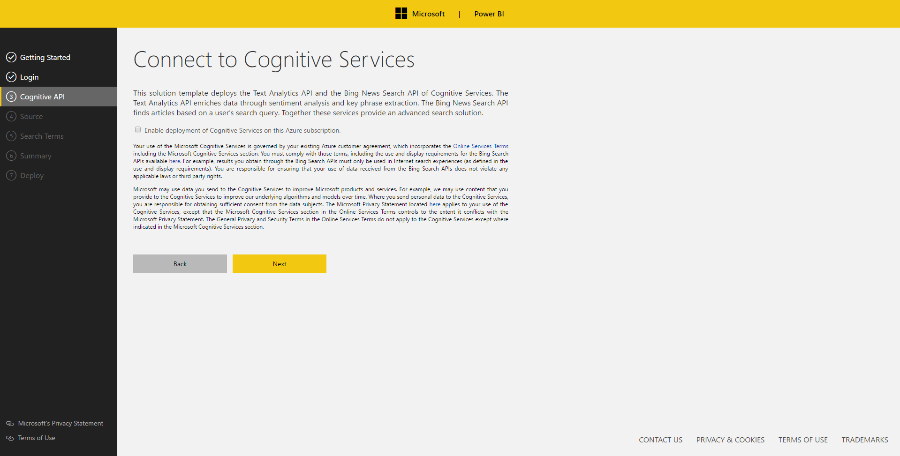
Upon clicking next on the “Connect to Cognitive Services” page you may run into the following error:
 
Your account admin (xxxx@yyyy.zzz) needs to enable cognitive services for this subscription. Ensure the account admin has at least contributor privileges to the Azure subscription. The following cognitive service should be enabled in order to proceed- TextAnalytics --- Action Failed Microsoft-RegisterCognitiveServices --- Error ID: (yuu0gk0pdevkt3knk)
 
This occurs when:
•	the Azure cognitive services APIs required by the solution template are not enabled
•	the solution template attempts to enable the required cognitive services on the user’s behalf, and
the individual provisioning the Bing News solution template does not have permissions to enable the Cognitive Services required by the solution template.

To fix this, your Azure account administrator needs to enable the cognitive services required by the Bing News solution template. The alias of your account administrator is included in the error message. Contact this individual and ask him or her to do the following:

1.	Connect to the Azure portal.
2.	Click the search icon on the top center, enter “Cognitive”, and click on “Cognitive Services accounts (preview)”
3.	Click the Add button
4.	In the “API Type” field, select “Bing Search APIs”
5.	Select the “API Setting”. You should see the following:

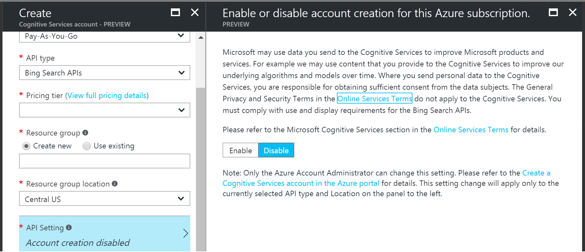

6.	 Select “Enable” and then “Save"
7.	 Repeat steps 4-6 but with “API Type” selected as “Text Analytics API (preview)”
 
Note that it is possible that an account administrator might not have permissions to enable these Cognitive Services (it is possible that they delegated this to the subscription administrator). If this occurs, then the subscription administrator must assign “Contributor” permissions to the account admin for the subscriptions.

**Target:** Connect to an existing SQL Server or provide details which the application will use to spin up an Azure SQL on your behalf. Only Azure SQL is supported for this template. If a user chooses to spin up a new Azure SQL, this will get deployed in their Azure subscription inside the newly created resource group.
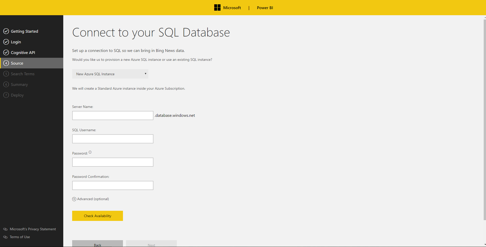

**Search Terms:** Input the search terms you are interested in tracking. Articles that match your search terms will be found using the Bing News cognitive service via the Logic App. Logic Apps supports any queries that the Bing News API supports. You can preview your search results [here]( https://www.microsoft.com/cognitive-services/en-us/bing-news-search-api).
Some recommended practices are as follows:
If you would like to look for multiple search words please use the OR operators (e.g. Microsoft OR Azure)
If you would like to look for a specific phrase please use quotation marks (e.g. “Surface Pro”)
If you would like to exclude a word from your search pleas use – (e.g. Azure -Color)
If you would like to learn how you can change your search terms once the solution is deployed, please look at the ‘Customizations’ section.

**Summary:** Summary page outlining all the choices the user made.

**Deploy:** When you navigate to the deployment page the setup process gets kicked off. The following steps take place (we will do a deep dive into all of these resources):
-	SQL scripts run to create the necessary tables, views and stored procedures
-	Azure Functions get spun up
-	Storage accounts gets spun up
-	Azure ML commitment plan get spun up and the web services get deployed
-	Cognitive services get deployed
-	2 Logic Apps get spun up

**It is important that you do not navigate away from this page while deployment takes place. This process could take 10-15 minutes** Once everything gets deployed a download link will appear for a Power BI file which consists of the pre-defined reports.

**Power BI File:** Once you download the Power BI desktop file you will need to connect it to your data. Open the pbix and follow the instructions on the front page (**it is important you do this before publishing the file to the Power BI Service. If this is not done the solution will not work inside the Service).**

Architecture Deep Dive
======================

The following section will break down how the template works by going through all the components of the solution.

Azure Resources:
----------------

You can access all of the resources that have been spun up by logging into the Azure portal. Everything should be under one resource group (unless a user was using an existing SQL server. In this case the SQL Server will appear in whatever resource group it already existed in).

Here is an example of what gets spun up for a user. We will go through each of these items one by one:

### Logic App (LogicAppMainNews):

Logic Apps are an Azure service for building integrated solutions. You can easily build business logic flows that consist of various actions and triggers. The Logic App with the name ‘LogicAppMainNews’ is the main orchestrator for this solution template. We will go through each step and explain what the Logic App does: 

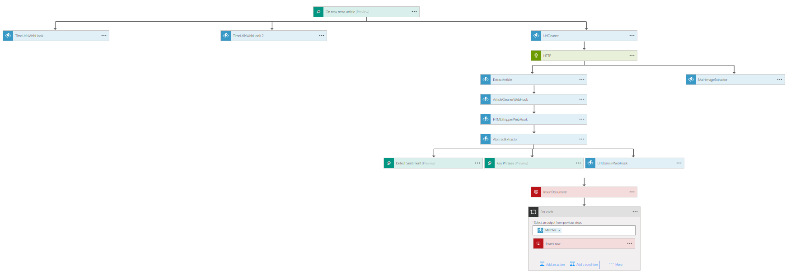

The first step inside the Logic App is called the trigger. This runs every 15 minutes and finds all the articles that match the Search Query (in this case the search query is Azure). All the published articles that mentioned the word Azure in the past 15 minutes are returned (the reoccurrence variable can be customized to make data collection less frequent).

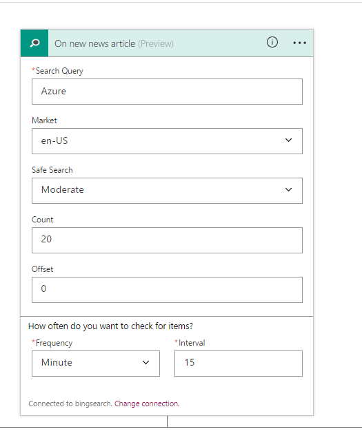

Here is an example of the response body returned:

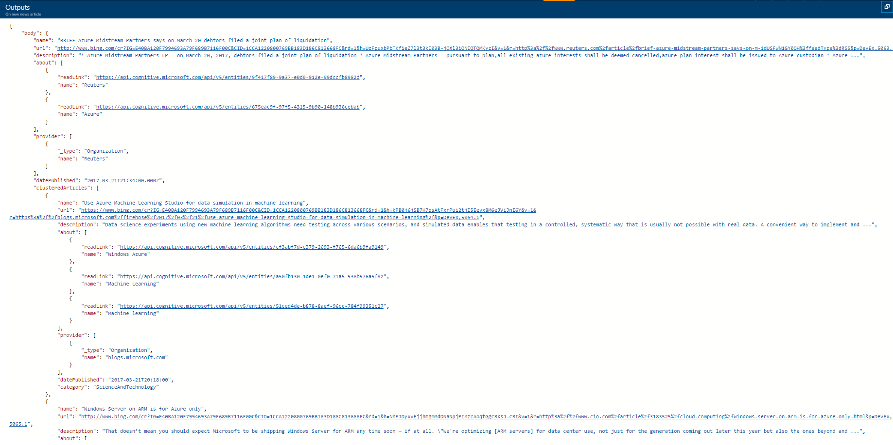

 You can learn more about the Bing News API [here]( https://msdn.microsoft.com/en-us/library/dn760793.aspx). 
Following the trigger, there are 3 parallel steps that run. All 3 of the steps consist of Azure Functions. Functions are a way of executing some code in a serverless experience. They are very handy for event based executions just like how we use them in the Logic App. To learn more about how to edit the function code please skip over to the Functions section.

TimeUtilsWebHook and TimeUtilsWebHook 2 are used to clean up the date field returned by the news trigger. This allows for clean slicing and dicing of data inside Power BI by fields like hour, day or month. The former Function looks at the ingest date (i.e. when did we process the article) and the latter looks at the publish time of the article (when was the article published).

The UrlCleaner function is used to extract out the website url from the news response body. An example call is shown here:

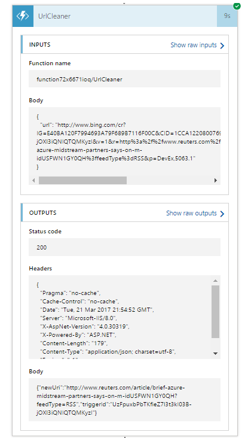

Once we extract out and clean up the URL from the trigger, we can now do a GET call to return the body of the article:

This still needs cleaning before we can consume it in a meaningful way:

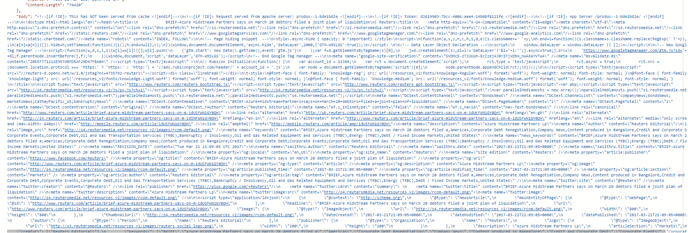

The ArticleCleanerWebHook and HTMLStripperWebHook clean up any unicode and html tags to leave us with text in the following form:

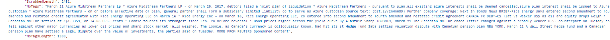

In parallel to the cleanup process, we also have a Function that extracts out an image URL from the article. This will be later used to load news images into the reports:

The aim of the AbstractExtractor Function is 2 fold – firstly it programmatically finds a snippet that will be displayed in the document tile inside the Power BI. The snippet it finds is contextual to the search term the user has specified (e.g. if a user is looking for Azure, the snippet will contain Azure).

The AbstractExtractor step also extracts out all the search terms it finds mentioned inside the article (e.g. if I was searching for Azure OR Google OR “Amazon Prime” and the article mentioned Azure as well as Azure Prime, the abstract extractor step would return Azure and Amazon Prime as matches). This allows us to later filter the entire report on those keywords.

Following the ‘AbstractExtractor’ Function, we now have 3 parallel steps that run. 2 of those steps come from the textual analytics cognitive services – Detect Sentiment and Key Phrases.

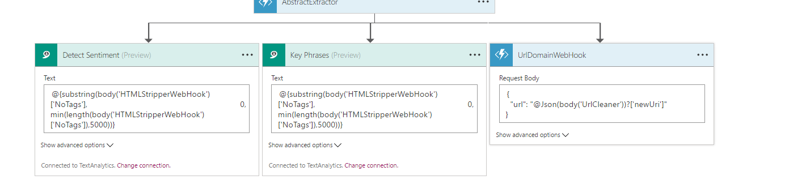

Detect sentiment returns a sentiment score for the article (ranging from 0 being very negative to 1 being very positive). Key phrases is an unsupervised learning method that returns back all the trending keywords found inside the document.

You can learn more about the cognitive services used in these steps over [here]( https://docs.microsoft.com/en-us/azure/cognitive-services/cognitive-services-text-analytics-quick-start).

In conjunction to the cognitive services, we also have a Function (UrlDomainWebhook) that extracts out the source of the news article found. 

We have now extracted and enriched all the data we need. The InsertDocument step runs a stored procedure (sp_write_document) that writes all of the data we need into SQL.

The final SQL step writes all of the matched search terms into SQL (the ones found via the Abstract Extractor function). There could be multiple search terms associated and matched with one document (hence the for each statement).

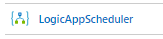

### Logic App (LogicAppScheduler):

Once the data is written into SQL, there are some enrichments that are done across the data (as opposed to on a document by document basis). These run on a schedule (reoccurrence every 3 hours but this can be changed inside the Logic App).

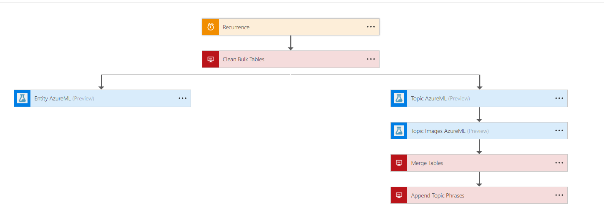

The first step following the trigger is a stored procedure called sp_clean_stage_tables. This empties out the staging tables that we are 
going to use for storing the outputs of the machine learning enrichments. If there is any data left over in them after the last time the Logic App ran, we want those truncated.

The next two parallel steps call Azure Machine Learning web services (you can read more about Azure ML in the sections below).

The ‘Entity AzureML’ webservice extracts out all the people, location and organizational entities it finds in the articles. 

The ‘Topic AzureML’ web service carries out topic clustering using a machine learning technique called Latent Dirichlet Allocation (LDA). This looks at the text of all the articles found and groups the documents together to form relevant topics. 

The final Azure ML component is the ‘Topic Images’ web service. The aim of this module is to extract out the relevant image URLs that go with the topics found. These are used to augment the topic clustering visual found in the Power BI report.

The final two components of this Logic App are stored procedures. So far, all of the Azure ML web services have been writing data into the previously cleaned out staging tables. The mergedata stored procedure replicates the data from the staging tables to their corresponding production tables.

The final stored procedure (create_topic_key_phrase) finds the keyword descriptors that correspond to the numerical values of the topic clusters (as LDA only returns the numerical equivalents). 

### Cognitive Services:

We already showed how the Azure Cognitive Service for Textual Analytics as well as Bing News get used inside ‘LogicAppMainNews’. This section will touch on the configurations that can be done to the cognitive services inside the portal.

Most importantly, a user is able to change the SKU they want to use for the Cognitive Service. As a default, we set the text analytics cognitive service to S1 (100K calls) which costs $150 per month. Depending on the anticipated traffic you can change the SKU to meet your needs (please remember the textual analytics cognitive service is used for both sentiment and key phrase extraction. This means that if e.g. you are processing 10K documents a month that translates to 20K calls to the textual analytics API).

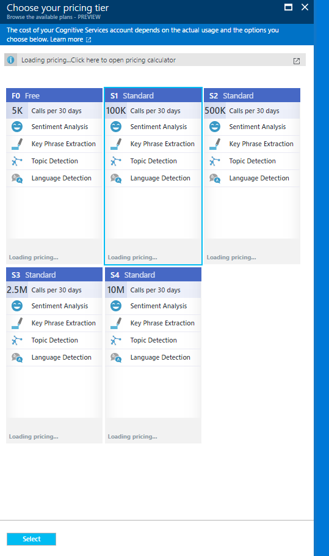

The Bing News cognitive service is by default set to an S2 SKU (10K calls a month – one article = one call). This can be changed inside the portal just like in the textual analytics cognitive service case:

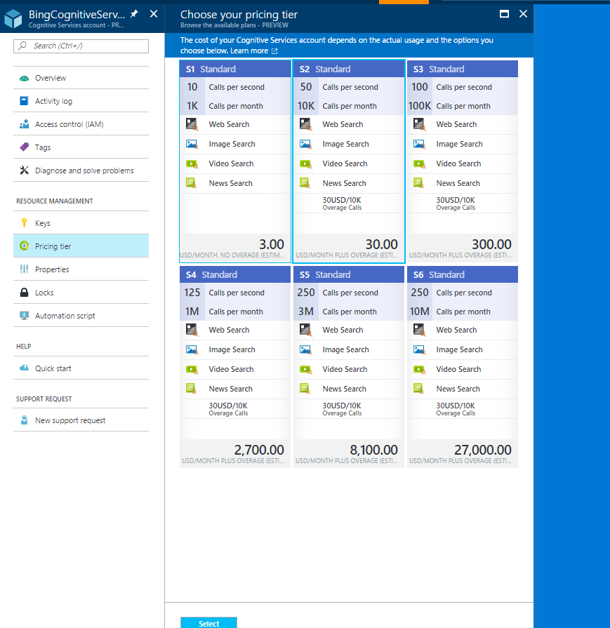

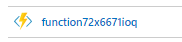

### Azure Function: 
This documentation has already covered the purpose of each Azure Function at a high level in the Logic App section. By default, you cannot edit the functions as they are deployed via continuous integration to GitHub (if you try to edit the function you will see a 
Ready only message at the top):

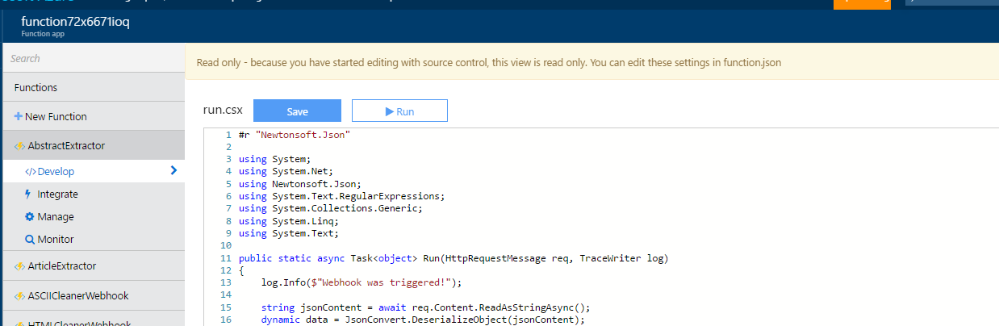

In order to edit the functions you will need to navigate to Function app settings and then click on ‘Configure Continuous Integration’. 

You can now disconnect the function from source control and edit the functions freely. **Please do not Sync the function from GitHub after deployment. There is a dll used by the Article Extractor function that is not available on GitHub. If you sync manually you will lose access to this dll and will have to set up the solution from scratch again**.

You can view the GitHub we sync our functions from over [here]( https://github.com/juluczni/AzureFunctionsNewsTemplate).

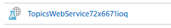

### Azure ML Web Services
The function of the Azure Machine Learning web services we spin up have been described in the ‘LogicAppScheduler’ section. 

Unfortunately, there isn’t much configuration that can be done with the Azure ML steps as it is only the web services that are deployed and not the actual experiments. The reason behind this is deploying the raw experiments would severely slow down the provisioning process. If you would like to edit the Azure ML experiments you can do so by:

[Approach needs to be verified and documentation updated]

### Azure ML Commitment Plan

or the Azure ML components, we spin up an S1 commitment plan. This allows us to have a total of 25 hours of compute a month, up to 10 web services and 100K transactions a month for $100. 

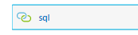

### Connectors
You will notice there are a number of steps with a chain icon. These are API connections that are used inside the Logic App to authenticate and connect to various services like SQL, Cognitive Services and Azure ML. These services store your credentials securely and can be updated if your credentials/keys ever change.
For example, editing my SQL API connection looks like this:

### Model Schema

Here is an overview of the tables found in the Power BI (names correspond to the Power BI tables not the underlying SQL tables or views):

| **Table Name**       | **Description **                                                                                                                                                                                                                                              |
|----------------------|---------------------------------------------------------------------------------------------------------------------------------------------------------------------------------------------------------------------------------------------------------------|
| Article | Stores all the metadata about the article (snippet, source URL, news category, image URL, published time etc.)                                                                                                                                                                                  |
| Article Search Terms | Stores the search term and corresponding document ID. There can be multiple search terms found in one document                                                                                                                                                                                  |
| Article Topics | Stores the topic ID each document is associated with as well as a numerical representation of the key phrases found.                                                                                                                                                                                 |
| Compressed Entities        | Document ID and an JSON object of the entities found. The document strippet custom visual uses the JSON to visualize the entities that appear in an article hence the JSON structure. The JSON stores the entity value, entity type as well as a CSS color and class.                                                                                                                                                                                |
| Entities | Stores the same information as the Compressed Entities table but in a structured format vs. JSON. |
| Key Phrases  | Stores the key phrases found with the corresponding document ID. A key phrase can belong to many documents and a document can belong to many key phrases)                                                                                                                                                                      |
| Sentiment Scores  | Stores the sentiment of an article along with the binned sentiment score and categorical score|
| Topic Images       | Stores the topic ID and up to 4 image URLs that are found to be associated with the given topic|
| Topic Key Phrases| Stores the topic ID with the word version of the key phrases that are used in the reports instead of the numerical output of the LDA model|

Below is a breakdown of the columns found in every table:

| ** Article ** |                                          |
|--------------------------|------------------------------------------|
| **Column Name**          | **Description**                          |
| Id                 | Document Id (unique)     |
| Abstract                 | Short snippet from the news article     |
| Title                   | Title of the news article                              |
| Source URL             | News article URL|
| Source Domain                  | News publisher URL               |
| Category            | Category of news article |
| Image URL                   | URL of image from news article                              |
| Image Width| Width of image in pixels|
| Image Height                  |Height of image in pixels               |
| Sentiment score            | Sentiment of article (from 0 – 1) |
| PublishedTimestamp| Timestamp when article was published |
| Published Month Precision| Month article was published in                           |
| Published Week Precision | Week article was published in                           |
| Published Day Precision | Day article was published on                           |
| Published Hour Precision | Hour article was published in                            |
| Published Minute Precision | Minute article was published |
| Ingested Month Precision| Month article was ingested |
| Ingested Week Precision | Week article was ingested |
| Ingested Day Precision | Day article was ingested |
| Ingested Hour Precision | Hour article was ingested |
| Ingested Minute Precision | Minute article was ingested |
| Count Entities | Number of entities found in article |

| **Article Search Terms** |                                          |
|--------------------------|------------------------------------------|
| **Column Name**          | **Description**                          |
| Document Id                 | Document Id (can be repeated)    |
| Search Terms                   | The specific search term found inside a given document. Multiple search terms can be found in a single document                              |

| **Article Topics** |                                      |
|--------------------|--------------------------------------|
| **Column Name**    | **Description**                      |
| Document Id                 | Document Id (a document belongs to one topic)     |
| Topic Id                 | Id of the topic cluster     |
| Document Distance                   | A score between 0 and 1 that represents how well a document fits within a topic.  0 is perfect and 1 is very poor.  
|
| Topic Score             | The number of documents in each topic|
| Topic Key Phrase                  | Numerical representation of the keywords a topic is associated with               |
| Image URL 1            | First image associated with topic |
| Image URL  2                | Second image associated with topic                            |
| Image URL  3                | Third image associated with topic                            |
| Image URL  4                | Fourth image associated with topic                            |
| Weight | Converts the document distance to scale of 0 to 100 with 100 as the highest. Higher weighted documents are a better fit for the topic cluster.  The formula is (1 - distance) * 100.
 |

| **Compressed Entities** |                                      |
|--------------------|--------------------------------------|
| **Column Name**    | **Description**                      |
| Document Id           | Document Id (unique) |
| Compressed Entities Json              | JSON object of all the entities found inside the article. For a more detailed breakdown of the Json object please look at the entities table which has a structured view of all the fields.            |

| **Entities**    |                                                                                                                   |
|-----------------------|-------------------------------------------------------------------------------------------------------------------|
| **Column Name**       | **Description**                                                                                                   |
| Document Id           | Document Id (not unique – a document can have multiple entities associated with it) |
| Entity Type              | Categorical variable of the type of entity found. ORG refers to Organization, LOC to Location and PER to Person|
| Entity Value              |The actual name of the entity that was found |
| Offset           |Character position of the start of the entity within the document.  |
| Offset Document Percentage         |Offset divided by document length.  A value of .25 indicates that the entity is found 25% through the document |
| Length           | Entity character length |
| Entity ID           | Merge of entity type with entity value (unique) |
| Entity Class           | Font awesome icons (scalable vector icons) |

| Entity Color           |Color (specified in hex) |

| **Key Phrases**         |                                                                                                                                                                                                           |
|-----------------------------|-----------------------------------------------------------------------------------------------------------------------------------------------------------------------------------------------------------|
| **Column Name**             | **Description**                                                                                                                                                                                           |
| Document ID                   | Document ID (one document can have multiple key phrases)                                                                                                                                                     |
| Phrases                    | A key phrase found inside an article |

| **Sentiment Scores**        |                                                                                                                        |
|-------------------|------------------------------------------------------------------------------------------------------------------------|
| **Column Name**   | **Descrpition**                                                                                                        |
| Id  | Document ID (unique – each document will have one sentiment score)                                                                          |
| Score              | Sentiment score ranging from 0 (very negative) to 1 (very positive)|
| Binned sentiment         | Sentiment grouped into intervals of 0.05 (e.g.  sentiment of 0.723 would fall into the 0.7 bucket)                                                |
| Sentiment         | Categorical variable for sentiment – categories include Very Negative, Slightly Negative, Neutral, Slightly Positive and Very Positive|

| **Topic Images**         |                                                                                                                                                                                                           |
|-----------------------------|-----------------------------------------------------------------------------------------------------------------------------------------------------------------------------------------------------------|
| **Column Name**             | **Description**                                                                                                                                                                                           |
| Topic Id                   | Id of the topic cluster                                                                                                                                                     |
| Image URL 1            | First image associated with topic |
| Image URL  2                | Second image associated with topic                            |
| Image URL  3                | Third image associated with topic                            |
| Image URL  4                | Fourth image associated with topic                            |

| **Topic Key Phrases**         |                                                                                                                                                                                                           |
|-----------------------------|-----------------------------------------------------------------------------------------------------------------------------------------------------------------------------------------------------------|
| **Column Name**             | **Description**                                                                                                                                                                                           |
| Topic Id                   | Id of the topic cluster                                                                                                                                                     |
| Key Phrase                    | The word descriptor of the topic cluster (usually 3 keywords) |

### Report Walkthrough
------------------

The following section walks through each report page outlining the intent of the page. 
In the sample report below we are tracking the Microsoft keyword and have been collecting data for the past 2 weeks. If you have just set up the template and don't see any data please be patient – the Azure ML experiments need to run prior to the topic clustering and entity extraction visuals loading. This could take a few hours (depending on whether you configure the schedule).

The template uses many custom visuals built by MSR for effective information retrieval. On the left hand side we can see the topic clustering visual (this is the output of the Azure ML Topic web service). This visualizes all the clusters generated by the machine learning model with the size of the visual determined by how many documents are present in a cluster. We also visualize the top 3 keywords that are associated with a cluster across the center.

The middle visual is the entity extraction visual that meaningfully represents the organizations, locations and people found inside the articles. This visual represents the output of the Azure ML entity web service. The colors of the entities are defined by the hex colors specified in the Entity Color field and the icons that appear next to each type of entity is specified by the Entity Class. 

The document strippet visual represents each article by an image, title and source. Clicking into a specific tile shows a short contextual snippet taken from the article. When clicking into a tile you will also notice more Entity Class icons appearing on the side. Hovering over these icons shows the specific entity they are associated with. The icons that appear represent all the entities found inside each article (and this visual is generated via the Compressed Entities JSON field).

Upon finding an article of interest you can navigate to read the full article by clicking on the article link.

Finally we also have a list of trending keyphrases (output of the key phrase cognitive service) and the average sentiment (output of the sentiment cognitive service).

As you can see, the overview page brings together the outputs of 4 different machine learning algorithms!

The following pages do a deep dive into one specific machine learning area but the intent of each page is the same - connect you with the articles most relevant and interesting to you. 

### Sentiment Analysis

The sentiment page allows you to answer questions like which entities linked to Microsoft are being perceived most negatively in the news as well as help you uncover why that is the case.

The left-hand side and middle visuals let you quickly identify and topics or entities that are consistently being talked about in a positive or negative way. The report displays sentiment on the x axis and the volume of documents on the y axis. Documents are grouped by either topics (left side) or entities (middle). Articles appearing in the top left hand corner of the graph are a cause of concern (topics/entities that are consistently negative) whereas top right hand corner articles indicate lots of positivity.

You can also drill into a specific sentiment bin to quickly isolate e.g. only the most negative articles or only the neutral ones. You can also see how sentiment changes across time.

### Topics

The topics page gives you added perspectives like which topics were trending last vs. this week. The trending key phrases complement the topic visualization very well. Upon drilling into  a topic, explore the keywords that are trending within the topic to get a very quick understanding of what the topic describes.

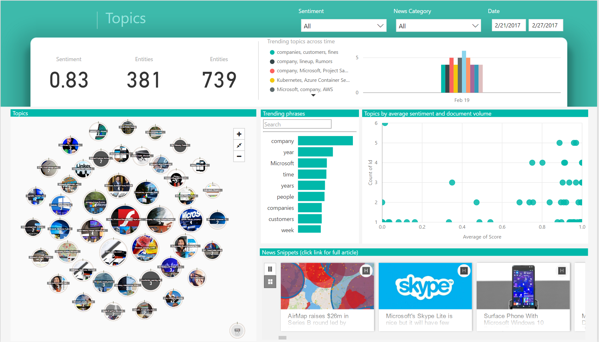

### Entities

We can dive deeper into entities by e.g. visualizing all of the location entities on a map. We can also take a look at which entities have been trending across time.

### Phrases

The phrases page allows us to explore which keywords the machine learning models have picked up as being trending, both on aggregate as well as across time. We can also see key phrases by sentiment – which phrases are associated with a negative vs. positive sentiment.

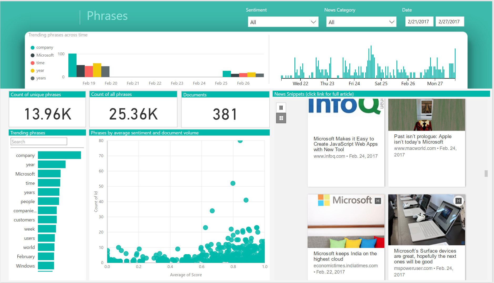

### Source

Finally, the sources page allows us to explore articles from a news publisher’s perspective. We can see which news publishers write about our search terms most frequently, and which are the most popular topics or entities they bring up.
If we want to find news articles to read from a certain publisher this is another nice way of filtering down the data.

### Updating your Search Terms
---------------------

Once you set up the solution template you may want to modify the search terms you are looking at.
If you want to change your search terms you will need to log into your Azure portal account and open your Logic App (LogicAppMainNews). Inside the Logic App you will need to open the first step (the trigger):

Inside this step you can see your specified Search Query. You can edit this and save the Logic App to update the query. This however will not wipe out the data from the database – it will just continue accumulating new data on top of the old data.

If you would like to completely wipe out the data before updating the search term you will need to do this manually by running the SQL scripts found inside our GitHub [here](https://github.com/Microsoft/BusinessPlatformApps/tree/dev/Source/Apps/Microsoft/Released/Microsoft-NewsTemplate/Service/Database). 

Running these scripts in order will clean up and recreate the database, views and stored procedures needed for the solution.

### Estimated Costs

Here is an estimate of the Azure costs (Logic Apps, Azure Functions, Azure SQL, Azure ML, Cognitive Services) based on the number of articles processed:

Processing 10K articles a month will cost approximately $420

Processing 50K articles a month will cost approximately $875

Processing 100K articles a month will cost approximately $1443

Please keep in mind these are estimated costs and subject to change. For a more detailed breakdown of the various components please refer to the [Azure calculator](https://azure.microsoft.com/en-us/pricing/calculator/) and select Logic App, Azure Function, Azure SQL, Cognitive Services and Azure ML. You can tweak all the options to see what the costs will look like and what modifications may suit your needs best.

The following defaults are set for you in the template (you can modify any of these after things get set up):

-   Azure SQL: Standard S1

-   App Service Plan: Dynamic

-   Logic App 1 (trigger set for every 15 minutes), 14 actions executed

-   Logic App 2 (trigger set for every 3 hours), 7 actions executed

-   Azure Functions (approximately 30 seconds run per article)

-   Azure ML (S1)

-   Cognitive Services – Text Analytics S1

-   Cognitive Services – Bing Search S2

For example, if you know you will be processing very few articles a month, you could change the SQL Server from S1 to Basic. 
Whilst the default setting should cater to most news template requirements, we encourage you to familiarize yourself with the various pricing options and tweak things to suit your needs.

