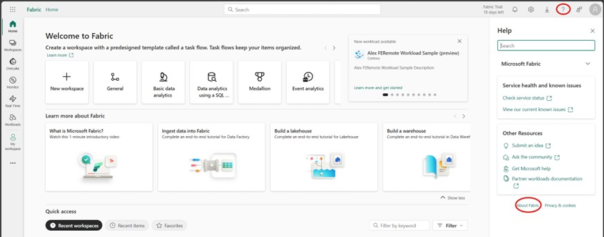
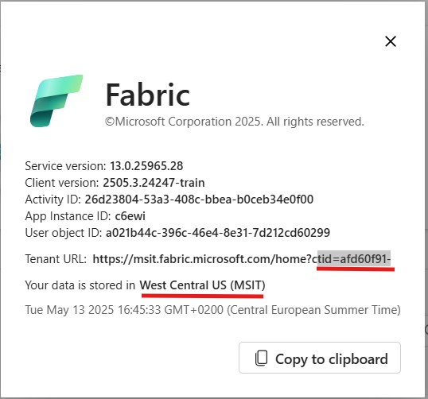
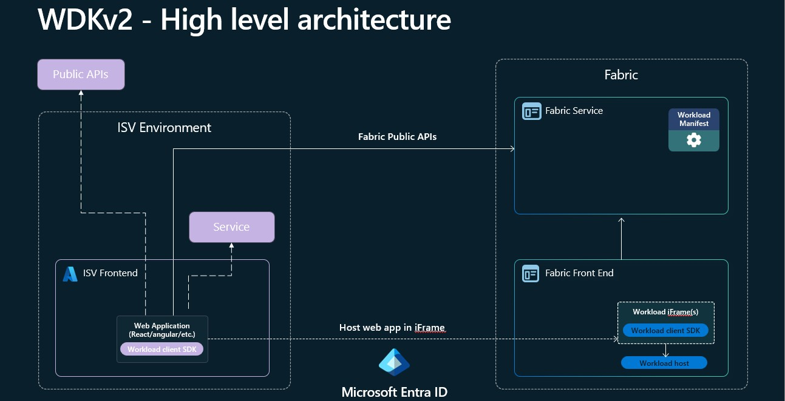
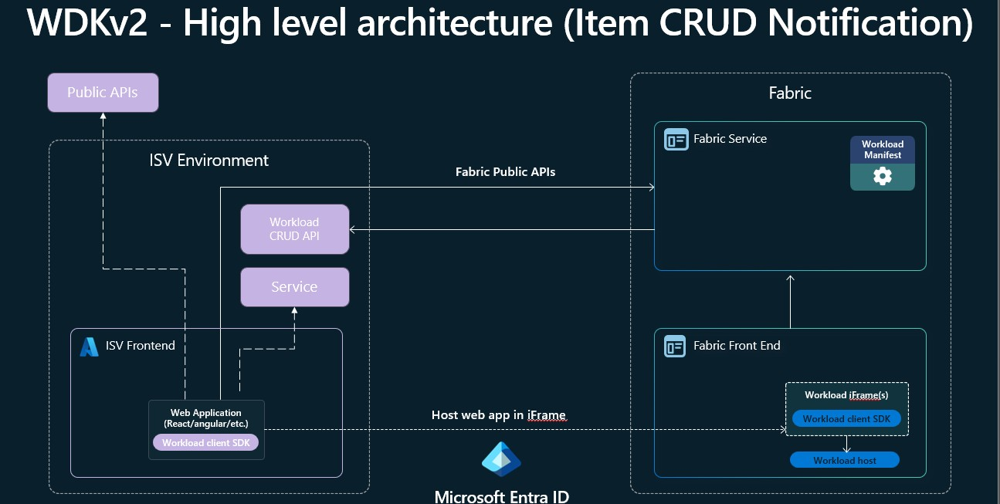

# Microsoft Fabric Software Developer Kit v2

## About the Workload Development Kit v2

The Workload Development Kit v2 (WDK v2) builds upon the foundation established by v1, addressing key gaps and introducing new capabilities to streamline workload development for Microsoft Fabric. The primary focus of v2 is on standardization, making it easier and faster for organizations to create and deploy workloads.

### Key Improvements in WDK v2

The workload development Kit v2 is an evolution of the existing WDKv1. The goal for us was to leverage the feedback we received form partners and customers and foucs on 3 main areas

- **Standardization:** v2 introduces more consistent patterns and practices, reducing ambiguity and simplifying the development process.
- **Accelerated Development:** Enhanced tooling and templates help organizations get started quickly and reduce time-to-market for new workloads.
- **New Functionallity:** New capabilities makes it easier for partners to get started and integrate their existing services and soltuions with Fabric. It was an important factor for us to meet developers where they are and allow everyone to build new capabilites for Fabric.

With these enhancements, WDK v2 empowers a broader range of developers to contribute to the Fabric ecosystem, making workload development more accessible and efficient.

### How to Find Your Tenant Information

Some development setup steps require your Tenant ID and Tenant Region. Follow these steps to locate this information in Microsoft Fabric:

1. Open Microsoft Fabric and click on your profile picture in the top right corner.
2. Select **About** from the dropdown menu.
3. In the About dialog, you will find your Tenant ID and Tenant Region.

_Figure: Accessing the About dialog in Microsoft Fabric._

_Figure: Locating Tenant ID and Tenant Region in the About dialog._

### High level architecture

By default WDKv1 only requires you to build a Frontend component that can access Fabric APIs as well as your Service APIs. This allows a very easy and fast forward way to get started with your development and meets most of the requirements that we have seen from partners.

_Figure: High level Architecture for WDKv2._

_Figure: High level Architecture for WDKv2 with Item CRUD Notification._

## Main new functionallity

WDKv2 introduces a suite of new capabilities designed to simplify and enhance workload development for Microsoft Fabric. These features enable developers to build richer, more integrated experiences with less effort. With WDKv2, you can easily access Fabric APIs directly from the frontend, persist item definition within Fabric, leverage a standardized item creation flow, and take advantage of improved security and interoperability through IFrame relaxation and public API support. Additionally, WDKv2 streamlines your development lifecycle with built-in CI/CD support, making it easier to automate deployment and testing. The following sections provide an overview of each new functionality.

### Standard Item creation experience

With WDKv2, item creation is standardized through a dedicated Fabric control that guides users through the process. This control allows users to select the workspace where the item will be created, assign Sensitivity labels, and configure other relevant settings. By using this standardized experience, you no longer need to handle the complexities of item creation yourself or worry about future changes to the process. Additionally, this approach enables item creation to be surfaced directly within your workload page, providing a seamless and integrated user experience.

### Frontend API support

With WDKv2, you can obtain an Entra On-Behalf-Of (OBO) token directly within your frontend application, enabling secure access to any Entra-protected API. This capability allows you to deeply integrate with Microsoft Fabric services—for example, you can read and store data in OneLake, create and interact with other Fabric items, or leverage Spark as a processing engine via the Livey APIs. For more details, see the [Microsoft Entra documentation](https://learn.microsoft.com/entra/), [OneLake documentation](https://learn.microsoft.com/fabric/onelake/overview), [Fabric REST APIs](https://learn.microsoft.com/rest/api/fabric/), and [Spark in Fabric](https://learn.microsoft.com/fabric/data-engineering/spark-overview).

### Storing Item Definition (State) in Fabric

This feature enables you to store your item's metadata—such as item configuration, and other relevant information—directly in OneLake within a hidden folder that is not visible to end users. The data is stored using the same format leveraged by public APIs and CI/CD processes, ensuring consistency and interoperability across different integration points. Details about the format and its use with public APIs and CI/CD will be discussed in the following sections.

### Storing Item Data in OneLake

Every item comes with it's own Onelake item folder where developers can store structured as well as unstructured data. Simmilar to a [Lakehouse](https://learn.microsoft.com/en-us/fabric/data-engineering/tutorial-build-lakehouse) the item has a Table folder where data can be stored in Delta or Iceberg format as well as a Files folder where unstructured data can be stored.

### Shortcut Data

As every item has it's own [Onelake](https://learn.microsoft.com/en-us/fabric/onelake/onelake-overview) folder they can also work with Shortcuts. Over the Public [Shortcut API](https://learn.microsoft.com/en-us/rest/api/fabric/core/onelake-shortcuts) workload developers can create different Shorcut types from or into their item to participate in the single copy promis from OneLake.

### CRUD Item API support

With WDKv2, users can create, update, and delete items with content using the standard [Fabric Item Rest APIs](https://learn.microsoft.com/en-us/rest/api/fabric/core/items). This automatic enablement makes it much easier to integrate with extension items in the same way as core Fabric items, streamlining interoperability and reducing the effort required to build robust integrations.

### CI/CD Support

CI/CD support for all items is one of the highest asks from our customers. With this feature, WDKv2 enables CI/CD support for all items out of the box, without the need to implement any specific logic or backend operations. This means you can automate deployment, testing, and updates for your workloads using standard DevOps pipelines and tools. The item format and APIs are designed to be fully compatible with CI/CD processes, ensuring a consistent and reliable experience across environments. For more information on integrating with CI/CD, refer to the [Fabric DevOps documentation](https://learn.microsoft.com/fabric/devops/).
**Note**: This feature is still in development

### Item CRUD notification API

There are cases where your workload needs to participate in the Item CRUD events. Compared to WDKv1 where items where only created from the UX in a controlled way by the Workload, WDKv2 allows item CRUD over several entry points (e.g. [Standard Item Creation](#standard-item-creation-experience), [Public API](#crud-item-api-support), [CI/CD](#cicd-support)). By default items store their [state](#storing-item-definition-state-in-fabric) in Fabric and don't need to get informed about the change of their item. Never the less there are some cases where workloads have a need to participate in the CRUD flow. This is mainly the case if Infrastructure for items need to be provisioned or configured (e.g. Databases). For these scenarios we allow partners to implement a Crud notification API which Fabric will call on every event. In this scenario Workload developers need to make sure that their API is reachable as otherwise Fabric operations will fail.
**Note**: This feature is still in development.

### Fabric scheduler

Fabric supports Job scheduling for workloads. This feature allows developers to build workloads that get notified even if the user is not in front of the UX and act based on the Job that should be executed (e.g. copy data in Onelake). Partners need to implement an API and configure their workload to prticipate in this functionallity.
**Note**: This feature is still in development

### IFrame Relaxation

With WDKv2, partners can request additional IFrame attributes to enable advanced scenarios such as file downloads or opening external websites. This feature allows your workload to prompt users for explicit consent before performing actions that require broader browser capabilities—such as initiating downloads or connecting users to external APIs using their current Fabric credentials. By specifying these requirements in your workload configuration, you ensure that users are informed and can grant the necessary permissions, enabling seamless integration with external systems while maintaining security and user trust.  
**Note**: Enabling this feature requires users to grant additional AAD consent for the relaxation scope, beyond the standard Fabric scope required for basic workload functionality.

## Feature Limitations

### Definition Validation

All Definition parts that are stored as part of the [Storing Item Definition (State) in Fabric](#storing-item-definition-state-in-fabric) are currently not validated. This will change in the future where partners need to provide schemas for the data that they are storing.

### Private Link

All workloads will be blocked for consumtion and development if the tenant has turned on Private Link on tenant or workspace level.
