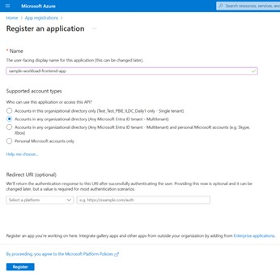

# Manual workload setup

If you are starting we recommend to use the [Setup.ps1](../scripts/Setup/Setup.ps1) script that will do all the work for you. In case you are interested in the details or try to skip some steps below is the information on how to configure the repository manualy.

## Register a Frontend Entra Application

You can leverage the [CreateDevAADApp.ps1](../scripts/Setup/CreateDevAADApp.ps1) to create a new Entra app or you can follow the steps below.

1. Navigate to App registrations in the [Azure Admin Portal](https://entra.microsoft.com/?culture=en-us&country=us#view/Microsoft_AAD_IAM/StartboardApplicationsMenuBlade/~/AppAppsPreview).
2. Create a new Multitenant application.

   

3. Add the following SPA redirectURIs to the application manifest:

   a. https://app.fabric.microsoft.com/workloadSignIn/{publisherTenantId}/{workloadId}

   b. https://app.powerbi.com/workloadSignIn/{publisherTenantId}/{workloadId}

You can find your Workload ID in the `WorkloadManifest.xml` as the value `WorkloadName`.

Looking for your Tenant ID? Follow these steps:

1. Open Microsoft Fabric and click on your profile picture in the top right corner.
2. Select **About** from the dropdown menu.
3. In the About dialog, you will find your Tenant ID and Tenant Region.

_Figure: Accessing the About dialog in Microsoft Fabric._

_Figure: Locating Tenant ID and Tenant Region in the About dialog._

## Configure your Workload to use the Frontend App

The next step is to configure your workload to make use of the new Frontend App.

1. Open the “Workload/.env.dev” file and insert your workload name in the “WORKLOAD_NAME” configuration property and your frontend application client id in the “DEV_AAD_FE_CONFIG_APPID” configuration property.
2. Run `npm install`

## Change the Workload Manifest

1. Open the “WorkloadManifest.xml”
2. Make sure the workload manifest “schemaVersion” is “2.000.0”.
3. Make sure the HostingType is “FERemote”
4. Under the “CloudServiceConfiguration”, add an “AADFEApp” element with an “AppId” of the workload frontend Entra application.
