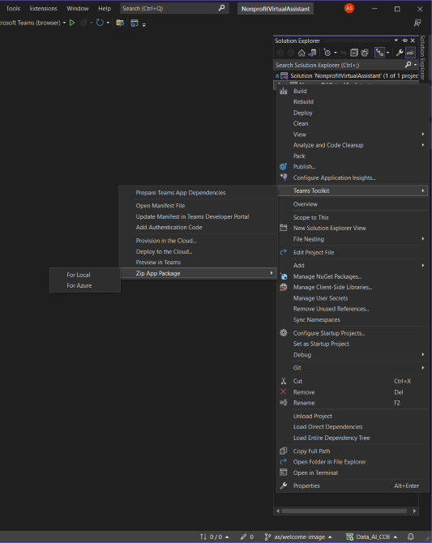

# Nonprofit Virtual Assistant (for Microsoft Teams)

Nonprofit Virtual Assistant is a Teams-based Virtual Assistant for nonprofit organizations, powered by OpenAI services. With the Nonprofit Virtual Assistant, nonprofit organizations can take advantage of the advanced language capabilities of OpenAI to simplify internal workflows and deepen their connection with their communities, patrons, donors, and stakeholders more effectively than ever before.
The assistant will focus on generating four essential letters: Funding Request Letter, In-Kind Donation Request Letter, Urgent Appeal Letter, and Volunteer Recruitment Letter.


## Prerequisites

- [OpenAI API account](https://platform.openai.com/signup)
- Azure resource group with rights to resource creation
- [Install Visual Studio 2022](https://visualstudio.microsoft.com/downloads/) (version 17.3+)
- [Install Teams Toolkit for Visual Studio](https://learn.microsoft.com/en-us/microsoftteams/platform/toolkit/install-teams-toolkit?tabs=vscode&pivots=visual-studio)
- [ngrok](https://ngrok.com/download) (needed for local debugging only)

## Setup

- Clone the repo. 

```
git clone https://github.com/ValoremReply/NonprofitVirtualAssistant.git
```

- Add an environment variable named `OPENAI_KEY` and set its value as the api key you get from [OpenAI api portal](https://platform.openai.com/account/api-keys). 

- Launch Visual Studio

    - From a _Developer Command Prompt for Visual Studio_ you can do the following to launch Visual Studio with the environment variable set:
    
    ```
    set OPENAI_KEY=<YOUR API KEY>
    devenv
    ```

- Open the solution csharp/NonprofitVirtualAssistant.sln. Right click on the project and make sure you have the Teams Toolkit menu option:



- Then follow the steps below for local or cloud deployment. If desired, you can skip the steps for local and provision to the cloud directly.

## Local deployment

1. Start ngrok in a terminal: `ngrok http 5130`.
2. Open solution in Visual Studio.
3. Right click project > _Teams Toolkit_ > _Prepare Teams App Depndencies_.
4. If prompted, sign in with a Microsoft 365 account for the Teams organization you want 
to install the app to.
5. Run/Debug (F5) to launch the project in Visual Studio.
6. In the launched browser, select the Add button to load the app in Teams.

## Cloud deployment

1. Open solution in Visual Studio.
2. Right click project > _Teams Toolkit_ > _Provision in the Cloud_.
3. If prompted, sign in with a Microsoft 365 account for the Teams organization you want 
to install the app to.
4. Choose a subscription and resource group to provision the resources, wait till provisioning is complete.
5. Right click project > _Teams Toolkit_ > _Deploy to the Cloud_.
6. Right click project > _Teams Toolkit_ > _Zip App Package_ > _For Azure_.
7. Find the generated zip in the _build_ folder alongside project and upload it to Teams as a custom app.

You can share/commit the generated `azure.parameters.env.json` file if you want to share the cloud provisioning details.

## Developer Notes

- You can use an existing Azure bot for deployment. Find instructions on how to do it [here](https://learn.microsoft.com/en-us/microsoftteams/platform/toolkit/provision?pivots=visual-studio#use-an-existing-azure-ad-app-for-your-teams-app-1).
- The bot was developed on Windows using Visual Studio. However, there aren’t any Visual Studio-specific dependencies, so you can use the Teams toolkit on VS Code as well if you so wish.

## FAQ
### Should the assistant use GPT -3.5 or GPT-4?
Although the app was tested with both GPT-3.5 and GPT-4, GPT-4 is recommended for optimal performance.

### Can the assistant use Azure Open AI?
The app functions with both OpenAI or Azure Open AI. The repo currently uses OpenAI. If you have access to Azure OpenAI, it is recommended to make the switch in the API call and also skip the call to OpenAI Moderation API.
[Request access to Azure OpenAI.](https://customervoice.microsoft.com/Pages/ResponsePage.aspx?id=v4j5cvGGr0GRqy180BHbR7en2Ais5pxKtso_Pz4b1_xUOFA5Qk1UWDRBMjg0WFhPMkIzTzhKQ1dWNyQlQCN0PWcu)

## List of third party javascript libraries/versions

- [Azure OpenAI](https://www.nuget.org/packages/Azure.AI.OpenAI)
- [TeamsFx](https://www.nuget.org/packages/Microsoft.TeamsFx)

