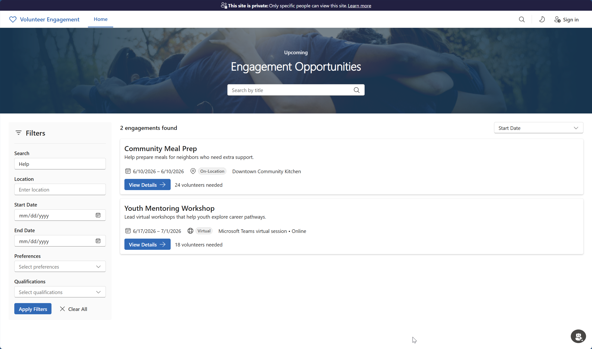

# Volunteer Engagement

Volunteer Engagement 2.0 is a Power Pages React single-page application (SPA) that helps volunteers discover opportunities, apply or register for engagements, manage profile information, and review their engagements. This package contains the Power Pages Enhanced Data Model implementation and AI-assisted migration guidance for moving legacy Volunteer Engagement site customizations to Volunteer Engagement 2.0.

## Solution overview

Volunteer Engagement provides a self-service Power Pages experience for volunteers and works with Volunteer Management, where staff create and manage engagement opportunities. Published opportunities from Volunteer Management are available in the Volunteer Engagement site so volunteers can interact with your organization through an external-facing web experience.

Volunteers can use Volunteer Engagement to:

- Create and update a profile with experience, skills, interests, availability, and contact information.
- Search for engagement opportunities that match their interests, schedule, and location.
- Apply or register for engagement opportunities by using their volunteer profile.
- Review upcoming and previous engagements, including participation details and contributed hours.

## Contents

| Path | Purpose |
| --- | --- |
| `.ai/` | AI guidance for migration, customization, deployment validation, accessibility, and development workflows. |
| `.github/` | Folder-local Copilot instructions, prompt, and skill definitions for Volunteer Engagement work. |
| [docs/](docs/) | Simple checklists for deployment, security, operations, and migration, plus the documentation plan. |
| [Portal-EDM/](Portal-EDM/README.md) | React + TypeScript + Vite SPA and Power Pages code-site metadata for Enhanced Data Model deployment. |

This folder doesn't include the solution packages for [Common Data Model for Nonprofits](../CommonDataModelforNonprofits/README.md) or [Volunteer Management](../VolunteerManagement/README.md). Before you deploy Volunteer Engagement, install and configure both in the target environment.

## Prerequisites

- [Common Data Model for Nonprofits](../CommonDataModelforNonprofits/README.md) and [Volunteer Management](../VolunteerManagement/README.md) are installed and configured in the target environment.
- [Power Pages Enhanced Data Model](https://learn.microsoft.com/en-us/power-pages/admin/enhanced-data-model) is enabled.
- [Power Platform CLI](https://learn.microsoft.com/en-us/power-platform/developer/cli/introduction) is installed and authenticated.

Volunteer Engagement itself doesn't need to be preinstalled. Run all development and deployment commands from `Portal-EDM/`. See [Portal-EDM/README.md](Portal-EDM/README.md) for setup, build, test, and deployment details.

## Where to go next

Use the checklist that matches your task:

- Deploy a new site: [Deployment Checklist](docs/deployment-checklist.md)
- Review security and permissions: [Security and Permissions Checklist](docs/security-and-permissions.md)
- Run go-live and support checks: [Operations Checklist](docs/operations-checklist.md)
- Migrate a legacy site: [Migration Checklist](docs/migration-checklist.md)

## AI-assisted development and migration

Volunteer Engagement-specific AI guidance is stored in `.ai/` and `.github/`. When using Copilot to work on this solution, open `VolunteerEngagement/` as the workspace root so that folder-local guidance is available for VE tasks.

For scenario-specific AI instruction files for SPA development, customization, deployment validation, and migration, see [Portal-EDM/README.md](Portal-EDM/README.md#ai-assisted-work).