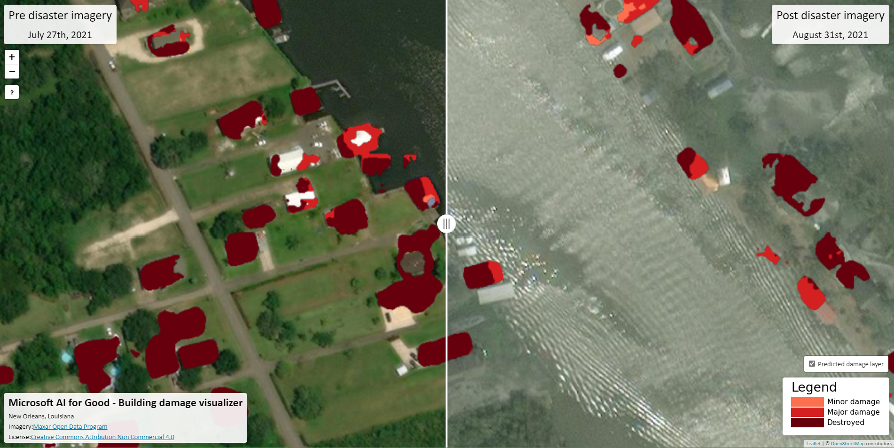

# Building damage visualizer

**Jump to: [Setup](#setup) | [Tutorial](#tutorial)**

This is a simple tool for comparing satellite imagery from two points in time alongside a modeled building damage overlay.



## Setup

The tool uses config files passed via the "config" URL parameter to run different "instances", e.g.: the URL `https://server.com/change_tool.html?config=new_orleans_example.json` will load the "new_orleans_example.json" file.

### Config file example

The below shows the format of the config file used to instantiate an instance of the tool.

```js
{
    "preImageryLayer": {
        "basemapURL": "http://server.com/basemap-pre/{z}/{x}/{y}.png", // URL for the "pre" imagery XYZ tiles
        "date": "January 1st, 2021", // date assosciated with the "pre" imagery
        "attribution": "", // string representation of the image attribution
        "bounds": [[lat1, lon1], [lat2, lon2]] // the bounding box for which the basemap is valid
    },
    "postImageryLayer": {
        "basemapURL": "http://server.com/basemap-pre/{z}/{x}/{y}.png", // URL for the "post" imagery XYZ tiles
        "date": "January 2nd, 2021", // date assosciated with the "post" imagery
        "attribution": "", // string representation of the image attribution
        "bounds": [[lat1, lon1], [lat2, lon2]] // the bounding box for which the basemap is valid
    },
    "changeImageryLayer": {
        "basemapURL": "http://server.com/basemap-change/{z}/{x}/{y}.png", // URL for the "change" imagery XYZ tiles
        "bounds": [[lat1, lon1], [lat2, lon2]] // the bounding box for which the basemap is valid
    },
    "center": [lat, lon], // the latitude and longitude of the initial map view
    "initialZoom": 12, // initial zoom level of the initial map view
    "location": "...", // the location that this file represents
    "imageryAttribution": "...", // HTML string for attributing the source imagery
    "license": "..."  // HTML string for the source imagery license
}
```


## Tutorial

This section provides detailed instruction on how to set up a demo instance of this tool using high-resolution imagery from the USDA's National Agriculture Imagery Program (NAIP).
We use this NAIP imagery simply for example purposes, it is not practically useful for distaster response applications as it is only collected once every two years on a state-by-state basis in the US. That said, it is freely available on the [Planetary Computer](https://planetarycomputer.microsoft.com/) and will allow us to easily demo the steps needed to set up the web interface with new imagery from scratch.

The following steps assume that you are running a linux version of the [Data Science Virtual Machine (DSVM)](https://azure.microsoft.com/en-us/services/virtual-machines/data-science-virtual-machines/) instance in Microsoft Azure and know the hostname/IP address of the machine. The steps to setup an example instance of the visualizer are as follows:
1. Clone the repo
```bash
git clone https://github.com/microsoft/Nonprofits.git nonprofits
cd nonprofits/visualizer/
```
2. Create a conda environment that contains the necessary packages (particularly GDAL).
```bash
conda config --set channel_priority strict
conda env create --file environment.yml
conda activate visualizer
```
3. Download the example NAIP data. We use NAIP scenes from 2013 and 2019 that overlap the Microsoft Redmond campus. These are formatted as [GeoTIFFs](https://en.wikipedia.org/wiki/GeoTIFF), a common image format for satellite or aerial imagery.
```bash
wget https://naipeuwest.blob.core.windows.net/naip/v002/wa/2013/wa_100cm_2013/47122/m_4712223_se_10_1_20130910.tif
wget https://naipeuwest.blob.core.windows.net/naip/v002/wa/2019/wa_60cm_2019/47122/m_4712223_se_10_060_20191011.tif
```
4. In the coming steps we will want to render our scenes using the `gdal2tiles.py` command which requires 3-channel (RGB) data formatted as "Bytes", so we need to preprocess the data we have into this format. The example NAIP data comes as 4-channel GeoTIFFs with "Byte" data types already -- to see this for one of the scenes you can run `gdalinfo m_4712223_se_10_1_20130910.tif` -- so we will just need to extract the RGB bands into their own file. Other sources of imagery may have different data types, different channels orderings, etc. and require more preprocessing. We use [gdal_translate](https://gdal.org/programs/gdal_translate.html) to do this preprocessing:
```bash
gdal_translate -b 1 -b 2 -b 3 -co BIGTIFF=YES -co NUM_THREADS=ALL_CPUS -co COMPRESS=LZW -co PREDICTOR=2 m_4712223_se_10_1_20130910.tif 2013_rgb.tif
gdal_translate -b 1 -b 2 -b 3 -co BIGTIFF=YES -co NUM_THREADS=ALL_CPUS -co COMPRESS=LZW -co PREDICTOR=2 m_4712223_se_10_060_20191011.tif 2019_rgb.tif
rm m_4712223_se_10_1_20130910.tif m_4712223_se_10_060_20191011.tif
```
5. We can now use `gdal2tiles.py` to render the tiles that will be shown on the web map interface. This step will produce two directories, `data/2013_tiles/` and `data/2019_tiles/` that contain rendered PNG versions of the imagery that will be displayed on the web map.
```bash
gdal2tiles.py -z 8-18 2013_rgb.tif data/2013_tiles/
gdal2tiles.py -z 8-18 2019_rgb.tif data/2019_tiles/
```
6. Now, to setup the configuration file we need some metadata from the input GeoTIFFs. We include a script that provides this:
```
python utils/get_bounds.py --input-fn 2013_rgb.tif
python utils/get_bounds.py --input-fn 2019_rgb.tif
```
7. Finally, create a new configuration file (similar to the "new_orleans_example.json" file) called "local_example.json" using the bounds and centroid information shown by `utils/get_bounds.py` and the path to the directories we created. We do not have building damage results for this demo, so will skip creating the "changeImageryLayer" object (unlike in "new_orleans_example.json").
```json
{
    "preImageryLayer": {
        "basemapURL": "http://<REPLACE WITH YOUR VM'S HOSTNAME/IP>:8080/data/2013_tiles/{z}/{x}/{y}.png",
        "date": "2013 imagery",
        "attribution": "",
        "bounds": [[47.62170620047876, -122.12082716224859], [47.69079013651763, -122.19162910382583]]
    },
    "postImageryLayer": {
        "basemapURL": "http://<REPLACE WITH YOUR VM'S HOSTNAME/IP>:8080/data/2019_tiles/{z}/{x}/{y}.png",
        "date": "2017 imagery",
        "attribution": "",
        "bounds": [[47.62170620047876, -122.12082716224859], [47.69079013651763, -122.19162910382583]]
    },
    "center": [47.656253585524624, -122.15620486525859],
    "initialZoom": 14,
    "location": "Redmond, Washington",
    "imageryAttribution": "<a href='https://planetarycomputer.microsoft.com/dataset/naip'>NAIP Imagery</a>",
    "license": "Proprietary"
}
```
8. Run a local http server with `python -m http.server 8080`
    - Make sure port 8080 is not blocked by the Azure level firewall through the "Network" tab of your VM in the Azure Portal. See [this page](https://docs.microsoft.com/en-us/azure/virtual-machines/windows/nsg-quickstart-portal) for more information.
9. Finally, navigate to http://<REPLACE WITH YOUR VM'S HOSTNAME/IP>:8080/change_tool.html?config=local_example.json in your browser to see the example in action!

Once you have confirmed that the local example is working, we suggest you move the contents of the visualizer to a stable web server. As the visualizer is completely static, it could be easily hosted on an [Azure blob container](https://docs.microsoft.com/en-us/azure/storage/blobs/storage-blob-static-website) or through a [local web server such as Apache](https://www.digitalocean.com/community/tutorials/how-to-install-the-apache-web-server-on-ubuntu-18-04).


## List of third party javascript libraries/versions

List of the libraries used by the tool:
- [leaflet 1.3.1](https://leafletjs.com/download.html)
- [NOTY 3.1.4](https://github.com/needim/noty)
- [jquery 3.3.1](https://jquery.com/download/)
- [leaflet side-by-side 2.0.0](https://github.com/digidem/leaflet-side-by-side)
- [leaflet EasyButton 2.4.0](https://github.com/CliffCloud/Leaflet.EasyButton)
- [font-awesome 4.1.0](https://github.com/FortAwesome/Font-Awesome)

This libraries are included in the `css/`, `js/`, and `fonts/` directories.
